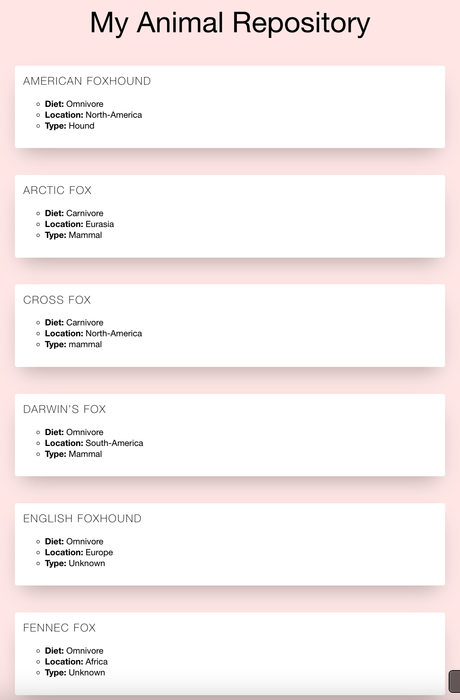

# My Animal Repository

This project is a simple Python-based script that generates a dynamic HTML page showcasing a repository of animals. The information about animals is retrieved from a JSON file and formatted into a visually appealing HTML file. The project also demonstrates basic file handling, HTML templating, and Python programming concepts.

## Features

- Dynamic generation of animal information in an HTML format.
- Utilizes Python for reading JSON data and processing it.
- Stylish and clean presentation of animal data using HTML/CSS.
- Replaceable placeholder in the template for flexible updates.

## How It Works

1. **Data Source**: 
   - Animal information is stored in a `JSON` file (`animals_data.json`).
   - Each animal includes details such as name, diet, location, and type.

2. **HTML Template**: 
   - A pre-existing `HTML` template file (`animals_template.html`) is used, with a placeholder `__REPLACE_ANIMALS_INFO__` for dynamic content.

3. **Python Script**:
   - Reads data from the `JSON` file.
   - Formats the data into structured HTML blocks.
   - Replaces the placeholder in the template with the formatted data.
   - Outputs a new HTML file (`animals.html`) for display in a browser.

## Project Files

- **`animals_data.json`**: The JSON file containing data about the animals.
- **`animals_template.html`**: The HTML template file with a placeholder for dynamic content.
- **`animals_web_generator.py`**: Python script to generate the HTML file.

## Output Example



The generated HTML page displays animal details in neatly styled cards with the following information:
- Name
- Diet
- Location
- Type

## How to Run

1. Clone the repository:
   ```bash
   git clone https://github.com/your-username/My-Zootopia.git
   cd My-Zootopia
